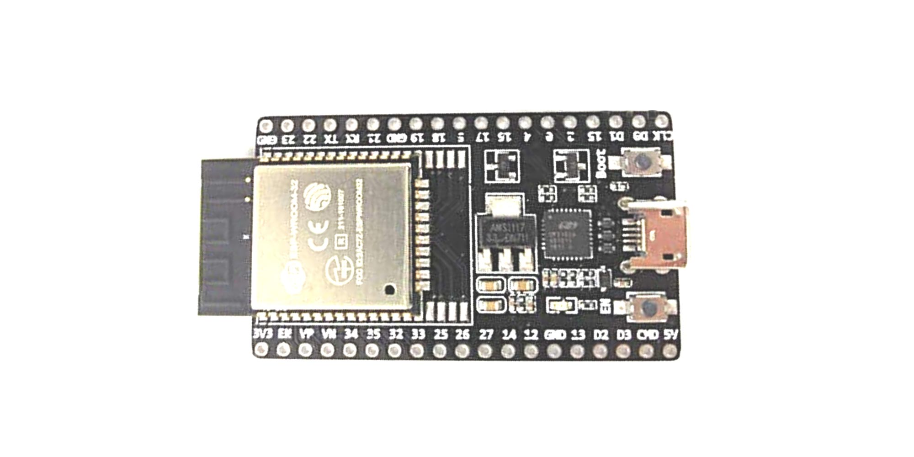
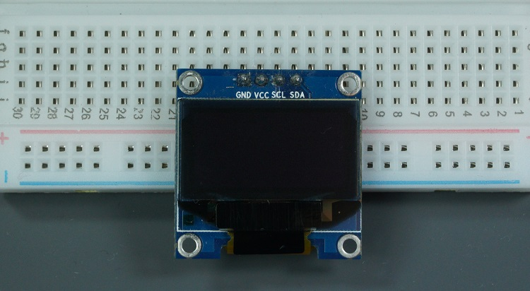
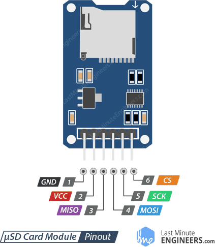
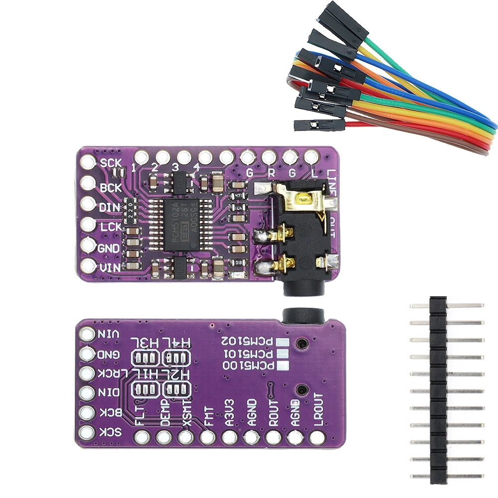
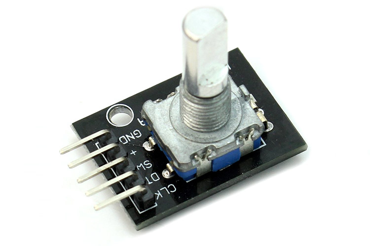
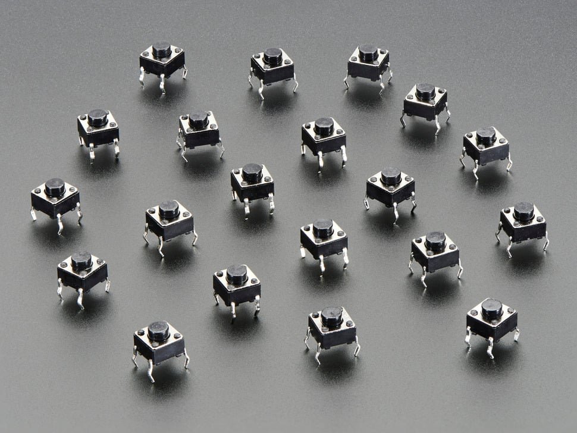

# ESP32 MP3 Player

A standalone MP3 player built on the ESP32-D0WD-V3, featuring I2S audio output via a PCM5102A DAC, a 128×64 OLED display, SD card playback, and rotary encoder + button controls. Audio decoding runs on a dedicated FreeRTOS task on Core 1, keeping the UI responsive on Core 0.

## Final Product

---

## Features

- MP3 playback from FAT32 micro SD card (up to 200 tracks)
- High-quality I2S audio via PCM5102A DAC
- 128×64 OLED display with scrolling track name, progress bar, and playback status
- Rotary encoder for volume control and menu navigation
- Next / Previous track buttons
- Play, pause, and resume support
- ~10 FPS display refresh with FreeRTOS task isolation

---

## Hardware Components

### ESP32 DevKit (ESP32-D0WD-V3)

The main microcontroller. Dual-core 240 MHz, Wi-Fi + BT (BT unused here), 38 pins.
Runs audio decoding on Core 1 and UI/input handling on Core 0.

---

### 0.96" OLED Display (SSD1306, 128×64, I2C)

Monochrome 128×64 pixel display driven over I2C.
Shows track name (with marquee scroll), progress bar, elapsed/total time, volume level, and playback state.

| Pin | ESP32 GPIO |
|-----|-----------|
| VCC | 3.3V |
| GND | GND |
| SDA | GPIO 21 |
| SCL | GPIO 22 |

---

### Micro SD Card Module (SPI / WEMOS D1 Shield)

FAT32 micro SD card reader over SPI (VSPI bus). Stores all `.mp3` files in the root directory.
Powered from 3.3V — no level shifter needed.

| Pin  | ESP32 GPIO |
|------|-----------|
| VCC  | 3.3V |
| GND  | GND |
| CS   | GPIO 5 |
| MOSI | GPIO 23 |
| MISO | GPIO 19 |
| SCK  | GPIO 18 |

---

### PCM5102A I2S DAC

High-fidelity stereo DAC (112 dB SNR) driven over I2S. Outputs line-level audio to a 3.5mm jack.
SCK, FMT, FLT, DEMP must be tied to GND; XSMT controlled by GPIO 2 to unmute the output.

| Pin  | ESP32 GPIO / Rail |
|------|------------------|
| VIN  | 3.3V (ESP32 output) |
| GND  | GND |
| BCK  | GPIO 26 |
| LCK  | GPIO 25 |
| DIN  | GPIO 27 |
| SCK  | GND (tie) |
| FMT  | GND (tie) |
| FLT  | GND (tie) |
| DEMP | GND (tie) |
| XSMT | GPIO 2 (software-controlled unmute) |

---

### KY-040 Rotary Encoder

Rotary encoder with push button. Rotating adjusts volume / navigates menus; pressing plays/pauses or confirms selection.
All pins use ESP32 internal pull-ups — no external resistors needed.

| Pin | ESP32 GPIO |
|-----|-----------|
| GND | GND |
| CLK | GPIO 32 |
| DT  | GPIO 33 |
| SW  | GPIO 13 |

---

### Tactile Push Buttons

Two momentary push buttons for Next Track and Previous Track.
Wired between the GPIO pin and GND; internal pull-ups used (active LOW).

| Button | ESP32 GPIO |
|--------|-----------|
| Next   | GPIO 4 |
| Prev   | GPIO 14 |

---

## Wiring

See [wiring.md](wiring.md) for the full pin reference table, power rail diagram, and all tie-off notes.

---

## Libraries

Install via Arduino Library Manager:

| Library | Purpose |
|---------|---------|
| [ESP8266Audio](https://github.com/earlephilhower/ESP8266Audio) | MP3 decoding + I2S output |
| Adafruit SSD1306 | OLED driver |
| Adafruit GFX | Graphics primitives |
| SD *(built-in)* | FAT32 SD card access |

---

## Build & Flash

1. Open `mp3_player.ino` in Arduino IDE (2.x recommended).
2. Select board: **ESP32 Dev Module**.
3. Install the four libraries listed above.
4. Flash. Serial output is disabled by default (`DEBUG_SERIAL 0` in `Config.h`).

---

## Troubleshooting

### Audio Distortion

**Distortion = sound is harsh, crackling, clipping, or "crunchy"**

#### Fix 1: Lower the Volume (Most Common)
- Set volume to **8–10** instead of max (21)
- Distortion goes away? → Issue is **clipping** (DAC output saturated)
- ESP32's audio output is limited; lower software volume prevents it

#### Fix 2: Use 3.3V Power for PCM5102A (Noise-Related Distortion)
- ✓ **CORRECT:** PCM5102A VIN → ESP32's **3.3V output** (cleaner power)
- ✗ **WRONG:** PCM5102A VIN → Raw 5V input (has ripple, causes noise)
- 5V supplies have more electrical noise; 3.3V from ESP32's LDO is filtered

#### Fix 3: Add a Power Filter Capacitor
- Solder a **100µF electrolytic capacitor** across PCM5102A VIN and GND
- **Polarity matters:** + on VIN, − on GND
- This filters power supply ripple → reduces hum/buzz distortion

#### Fix 4: Use Shielded Audio Cables
- Connect PCM5102A output → headphone jack with **shielded cables**
- Unshielded wires pick up EMI and 60 Hz hum from nearby electronics
- Twist the wires together if shielded cable unavailable

#### Fix 5: Check Solder Joints (I2S Wires)
- Loose solder on BCK, LCK, DIN pins → noisy I2S signals → distortion
- Re-solder: GPIO 26 (BCK), GPIO 25 (LCK), GPIO 27 (DIN) to PCM5102A
- Look for shiny, smooth solder joints (not dull or cracked)

#### Fix 6: Verify All Control Pins are Grounded
- SCK → GND ✓
- FMT → GND ✓
- FLT → GND ✓
- DEMP → GND ✓
- Missing ground = wrong DAC mode = possible distortion

#### Fix 7: Check MP3 File Quality
- Test with a known-good MP3 file
- Bitrate should be 128 kbps or higher
- If distortion only on certain files → files are corrupted

### No Audio
- **XSMT pin not unmuted:** Verify GPIO 2 is connected to PCM5102A XSMT pin
- **I2S wiring:** Double-check BCK (26), LCK (25), DIN (27) are soldered correctly
- **Power:** Verify PCM5102A is getting 3.3V on VIN pin

### 4-Pin Button Wiring
- 4-pin momentary switches have two diagonal pairs of internally-connected pins
- Use a multimeter on continuity mode to identify which pins connect when pressed
- Wire one pin to GPIO (4 or 14) and the other to GND

---

## Configuration

All tuneable constants live in [`Config.h`](Config.h):

| Constant | Default | Description |
|----------|---------|-------------|
| `VOLUME_DEFAULT` | 15 | Initial volume (0–21) |
| `VOLUME_MAX` | 21 | Max volume |
| `MAX_TRACKS` | 200 | Max files scanned on SD |
| `UI_REFRESH_MS` | 100 | Display refresh interval |
| `SCROLL_STEP_MS` | 200 | Marquee scroll speed |
| `DEBOUNCE_MS` | 50 | Button debounce window |
